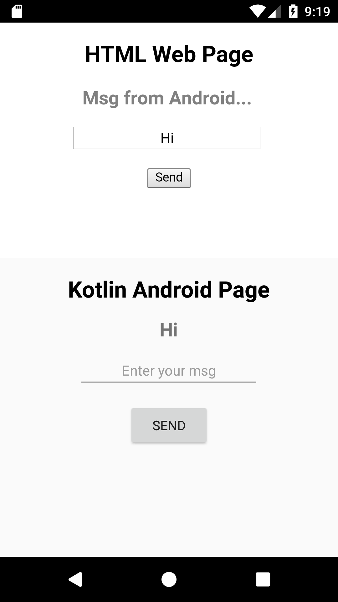

# WebViewApp
WebView App with Kotlin.

An Android App to create a WebWiew to display Web Page from local storage.

Inject Kotlin's custom functions in JavaScript to exchange message between JavaScript and Kotlin.

Re-assign the variable jObj containing a Window Object with a Kotlin's Object name (in String) by putting it under pre-defined ECMA6 function : eval() during assignment to make name (a String) into a String Template.

Use the newly obtained jObj to check whether the page is loaded in the App or Not.

# index.html
WebView Page 1

A sample page to test my project : WebViewApp

Check this page out @ https://fifthsirean02.github.io/WebViewApp/

# Screenshots
Pic - 1 | Pic - 2 | Pic - 3
------- | ------- | -------
 |  | 

