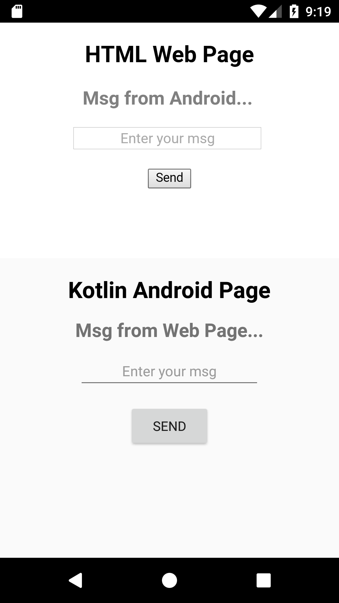
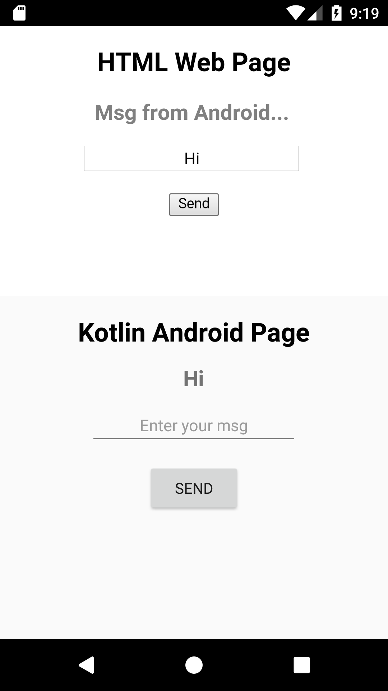
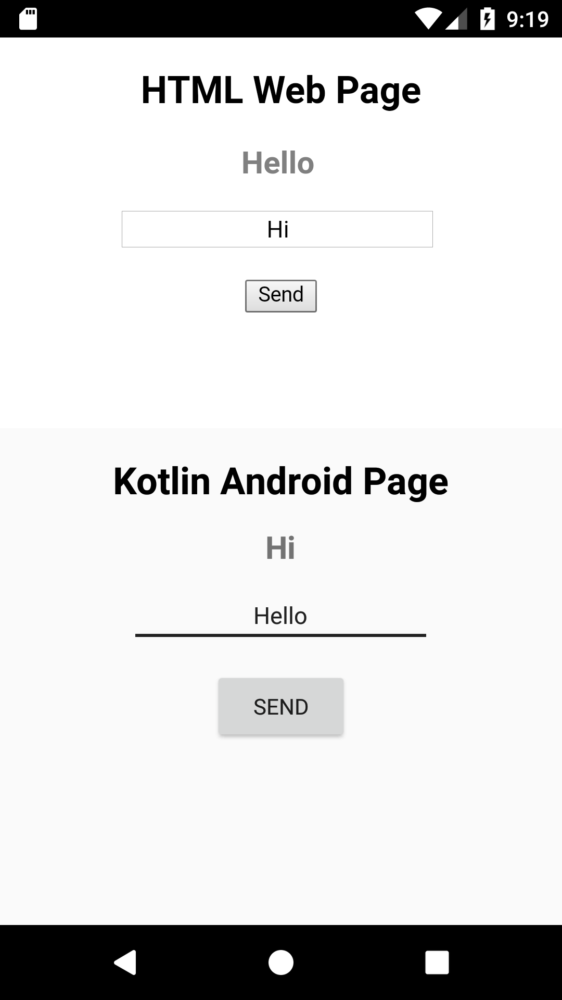

# WebViewApp
**WebView App** with **Kotlin**.

An Android App in **Kotlin** to create a _**WebWiew**_ to display _**Web Page**_ from _online / cache memory / local storage_.

Inject Kotlin's custom functions in ECMA Script to exchange message between JavaScript and Kotlin.

Re-assign the variable **`jObj`** containing a Window Object with a Kotlin's Object name (in String) by putting it under pre-defined ECMA Script v6's function : `eval()` during assignment to make name (a String) into a String Template.

Use the newly obtained **`jObj`** to check whether the page is loaded in the App or not.

---

# index.html
**WebView Page 1**

A sample page to test my project : **WebViewApp**

Check this page out **@** ![Project's Page]: https://nishantsinghdev.github.io/WebViewApp/

---

# Screenshots
|  Web App - 1  |  Web App - 2  |  Web App - 3  |
| :-----------: | :-----------: | :-----------: |
|  |  |  |

---
